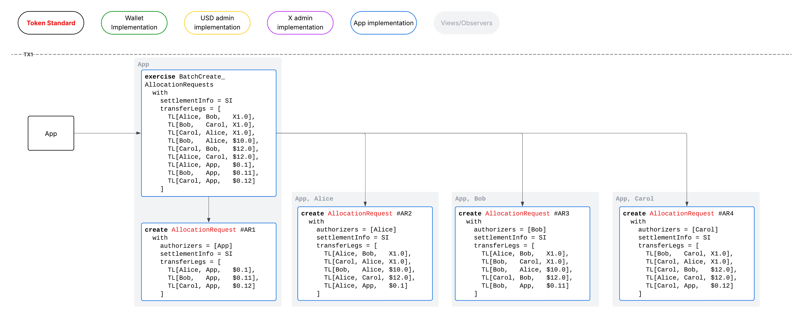
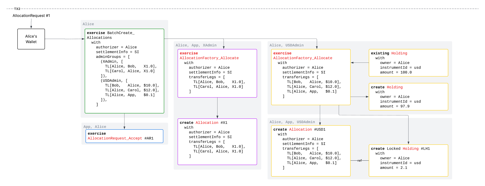
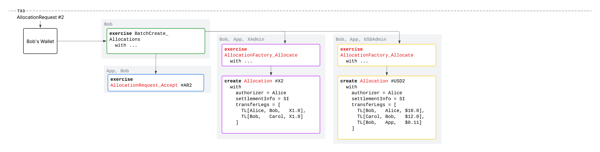
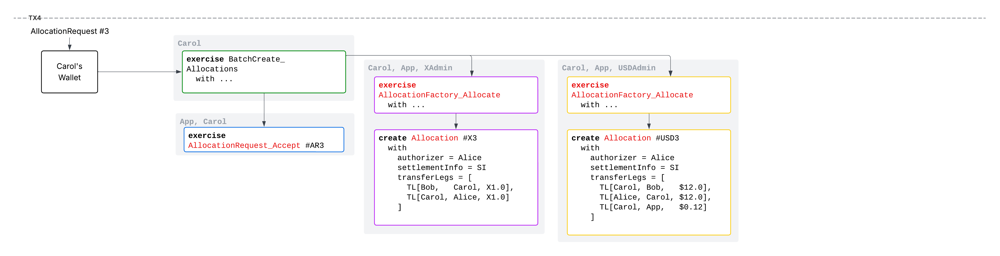
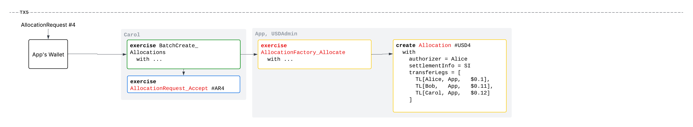
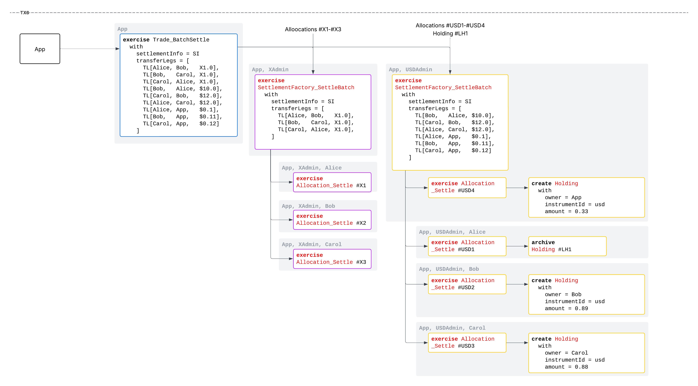
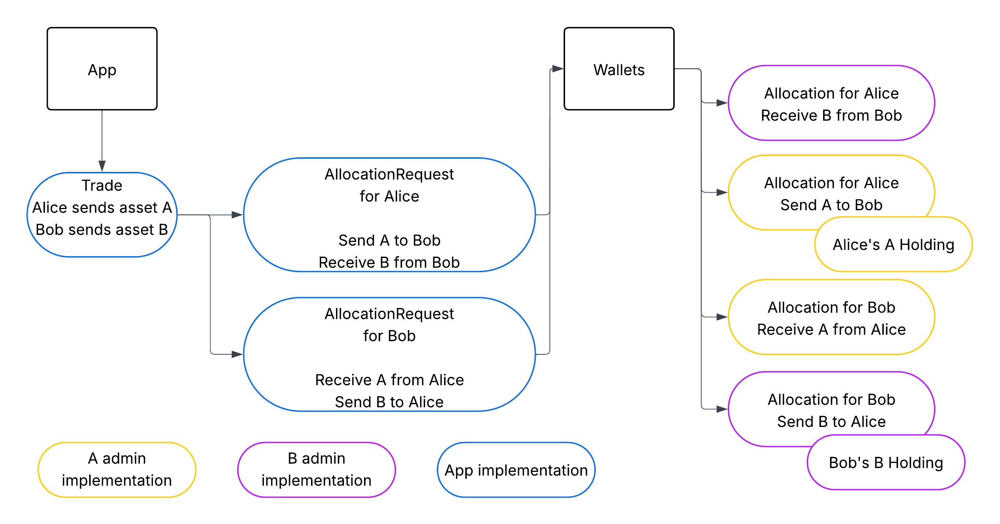

<pre>
  CIP:  CIP-0112
  Layer: Daml
  Title: Canton Network Token Standard V2 - Improvements for Privacy, Performance and Traditional Accounting
  Author:
    Bernhard Elsner
    Simon Meier
  License: CC0-1.0
  Status: Proposed
  Type: Standards Track
  Created: 2026-03-31
  Approved: 
  Post-History:
</pre>


# **1\. Abstract**

This proposal outlines a set of improvements to the [CIP-0056 token standard](../cip-0056/cip-0056.md). These enhancements make the token standard more suitable for integration with trading and settlement venues across the TradFi and DeFi spectrum, as well as for on-chain securities that model holding and settlement via custody chains. They also include improvements to settlement efficiency at the protocol level as well as optimization to the funds that need to be allocated. A high level of backward compatibility with CIP-0056 means that the evolved standard will further foster interoperability between wallets, apps, and assets across crypto and traditional finance.


# **2\. Motivation**

The Canton Network token standard specified in [CIP-0056](../cip-0056/cip-0056.md) is the baseline universal interoperability layer between assets, apps, and wallets: Any asset, app, or wallet that implements the standard can interoperate seamlessly with any complement.

By rearranging some of the settlement flows, making controllers of choices and observers of events more configurable, and adding additional fields to keep track of account information, a significant amount of flexibility can be added to the CIP-0056 standards. In particular, such changes give traditional settlement venues and assets that are settled along multi-tier account/custody chains an easy path to implement the desired user flows, privacy, and controls to match equivalent processes on traditional systems. These improvements increase the applicability of the CIP-0056 token standard to traditional finance, and thus its ability to foster the confluence of TradFi and DeFi on Canton Network. And they allow Allocations to be used for a broader set of workflows like prefunded trading or "Delivery versus Mint/Burn" trades that are suitable for stablecoin or fund subscriptions and redemptions.

To prevent splitting the on-chain ecosystem into a cluster interoperating via the existing CIP-0056 standard, and a separate ecosystem of regulated assets and services, the enhancements will be made via a backwards compatible evolution of CIP-0056 that is more accommodating to traditional assets that are brought on-chain.


# **3\. Specification**

We propose to evolve the Canton Network token standard defined in [CIP-0056](../cip-0056/cip-0056.md) by adding new major versions of the token standard packages:

* `splice-api-token-allocation-instruction-v2`
* `splice-api-token-allocation-request-v2`
* `splice-api-token-allocation-allocation-v2`
* `splice-api-token-holding-v2`
* `splice-api-token-transfer-instruction-v2`
* `splice-api-token-standard-utils` for shared types and functions, including those shared between versions and used for cross-version compatibility.
* `splice-api-token-transfer-events-v2` for the new transaction parsing functionality.

We do not propose to add `splice-api-token-metadata-v2` Daml package, as there is no change required to the v1 version to support the objectives of this CIP. We do however propose a backwards compatible change to the `token-metadata-v1.yaml` OpenAPI specification file to allow assets to advertise support for non-basic accounts and reporting the pause status of an asset.

The specific changes relative to V1 are covered in the rest of this document:

* [Section 4](#4-functional-extensions) covers the changes in interfaces and the new capabilities made possible.
  * [4.1](#41-feature-descriptions) covers the use cases and reasons for the enhancements.
  * [4.2](#42-uxflow-example-in-detail) covers the changes to interfaces and guidelines.
* [Section 5](#5-backwards-compatibility) covers cross-version compatibility with the V1 standards.
* [Section 6](#6-canton-coin-implementation) covers how Canton Coin will implement token standard V2 in a fully backwards compatible way.
* [Section 7](#7-example-implementation-for-performant-privacy-preserving-settlement) covers planned examples and demonstrations in integration tests, that will illustrate how to implement a token for the V2 standards, and how wallets and trading and settlement venues should integrate with the standard(s).

The full specification of the V2 interfaces, the implementation of the V2 interfaces and compatibility rules on Canton Coin (/Amulet), and a reference `TestTokenV2` that demonstrates the feature set of the CIP-0112 can be found on [the preview branch](https://github.com/canton-network/splice/tree/token-standard-v2-upcoming).

# **4\. Functional Extensions**

## 4.1 Feature Descriptions

### 4.1.1 Privacy Enhanced Batch Settlement

In traditional multi-tier accounting, the transfer of an asset involves the debiting and crediting of potentially multiple intermediary accounts between `sender` and `receiver`. Neither the `sender` nor the `receiver` see the intermediate steps, but only the debits/credits to their accounts. The only entities with full visibility into a settlement across all involved assets are the settlement systems/processors which in the Canton token standard correspond to the `executor` party. Other key parties like custodians or asset registries, corresponding to the `admin` party on CIP-0056 tokens, have visibility across the assets managed by them.

Mirroring the above privacy model allows for privacy preserving settlements that CIP-0056 does not currently support. For example, let’s imagine this scenario in the context of a settlement application (App) that acts as `executor`:

* Alice sold 1.0X for \$10 to Bob. Alice needs to send the App \$0.1 fee.
* Bob sold 1.0X for \$11 to Carol. Bob needs to send the App \$0.11 fee.
* Carol sold 1.0X back to Alice for \$12. Carol needs to send the App \$0.12 fee.

There are a total of nine transfer legs here:

* Three legs of 1.0X between the traders
* Three legs of \$ between the traders
* Three legs of \$ for the App fees.

The visibilities should be exactly this:

* **Traders** each see…
  * … the two X transfer legs for the incoming and outgoing transfers.
  * … the two \$ transfer legs incoming and outgoing payments to other traders.
  * … the one outgoing fee leg to App.
* **X admin** sees the three X legs.
* **\$ admin** sees the six \$ legs.
* **App** sees all nine legs.

Furthermore, in such a settlement, no X should have to move at all, and the only party that should need to deliver any assets at all is Alice for her \$2.1 loss.

Other examples of privacy preserving batch settlement with multi-tier account chains could be found in a number of industry initiatives like the US RSN project, or in general by [Daml Finance’s](https://github.com/digital-asset/daml-finance) batch settlement code.

The token standard V2 proposed here makes the above possible via the standard whereas it is not possible with the CIP-0056 token standard V1.

### 4.1.2 Improved User Flows with Trusted Venues

Assets like Canton Coin require sender and receiver authorization to move. Consequently, for any trade, the traders need to sign a transaction at some point that authorizes the settlement of that trade. In the CIP-0056 example DvP, this is done twice: First through a propose-accept flow where a buyer and seller agree to trade on-chain, and then a second time to create the allocations.

Settlement venues like the App in the example in [4.1.1](#411-privacy-enhanced-batch-settlement) may not actually do execution on-chain like the CIP-0056 example. Instead, the executed trade is written to the chain with only the `executor` as signatory. For such venues, it would be ideal if the creation of the allocation could be taken as the authorization of the trade so that traders only have to take that singular action. The flow should be:

1. The App writes the executed trade to the chain, authorized only by the App.
2. Alice, Bob, and Carol see the request to allocate and authorize the trade in their wallets and accept in a single action.
3. The App can now do the privacy preserving settlement of the trade example shown in the prior [Section (4.1.1)](#411-privacy-enhanced-batch-settlement).

The V2 token standard proposed here makes this simple flow possible by creating `AllocationRequests` in (1.), `Allocations` in (2.), and then settling them in (3.). With [CIP-0103 dApp connectivity](../cip-0103/cip-0103.md), it’s also possible to skip step 1 and have the App make a signing request to the wallets to create the required Allocation directly instead of writing an `AllocationRequest` to the ledger.

In the token standard V1 this flow is not possible. Step 1 can create the needed `AllocationRequests`, and Step 2 can create the needed `Allocations`. But there is no way to assemble the authority of the `Allocations` to execute them. So trading venues that execute off-chain have to get additional signatures from the traders to actually settle.

### 4.1.3 Accountable Holdings

In traditional finance, holdings are held in accounts with banks, custodians and account keepers playing a key role in enforcing compliance on assets and/or controlling the held assets based on requests and instructions from the beneficial owners. As discussed above, settlement may involve debits and credits on multiple accounts in multi-tier account chains. The current token standard offers ways to capture some of this in metadata, but cannot adequately capture the implications to authorization rules that are implied by assets held on managed accounts.

Case in point, CIP-0056 `Allocations` which are core to the settlement flows relevant to 4.1.2 are an authorization mechanism. An `Allocation` is supposed to represent an *authorization* from all needed stakeholders for the `executor`(s) to settle, and if triggered, settlement should be near-guaranteed to go through. For assets that employ traditional accounting structures, the authority of account managers or custodians become key in preparing and settling `Allocations`.

The token standard V2 proposed here systematically replaces the beneficial owner as represented by a `Party` with an `Account` data structure to capture the information in a standardized way and allow wallets and settlement venues to make use of the information. It also adds flexible authorization to all the interfaces allowing different tokens to encode different authorization rules for holdings held in a traditional account.

### 4.1.3.1 Accounts representing Non-Holder Destinations

Using Accounts rather than `Party` as the source and destination of operations like transfers also allows for the clean representation of non-transfer operations like burns and mints. This is analogous to Ethereum where commonly the `null` address (`0x0000000000000000000000000000000000000000`) is used as the source/destination for mints and burns. Canton doesn't have a "null Party", but the `Account` data structure can represent special ownerless accounts that represent the source and destination of mints and burns, respectively.

This opens up using standard transfer and allocation workflows for mint and burn operations. Most notably, it opens up the possibility to settle "Delivery vs Mint" and "Delivery vs Burn" trades, where fund or stablecoin operators can allow subscriptions or redemptions as part of trades.

### 4.1.4 Improvements to Timing Parameters

In line with practices in traditional financial markets, the time-related fields within `SettlementInfo` are changed to allow more flexibility. The previously mandatory inclusion of `settleBefore` and `allocateBefore` deadlines is too restrictive for workflows where settlement is not driven by time but by external business events or bilateral agreements. The timing parameters have also moved form `SettlementInfo` to `AllocationSpecification`, turning `SettlementInfo` into exactly that part of the `AllocationSpecification` which links it to an overall settlement.

### 4.1.5 Improved Transaction Parsing

CIP-0112 introduces a new `EventLog` interface, which emits standalone events as side-effect free non-consuming choices, similar to ERC-20 events. This simplifies parsing for wallets, exchanges and apps: just look for `EventLog_HoldingsChange` events to understand all changes to the holdings of an account.
It also makes things easier for asset implementations as they get more fine grained control over who sees what.

To contrast, [CIP-0056 transaction history parsing](https://docs.digitalasset.com/integrate/devnet/exchange-integration/txingestion.html#differences-between-1-step-deposits-and-withdrawals) relies on interpreting the choices from the `TransactionFactory`, `TransactionInstruction`, `AllocationFactory`, `AllocationInstruction`, and `Allocation` interfaces as events with a fallback to metadata. Both have some shortcomings: Using the interfaces choices as events means that observing the event means observing all consequences thereof. E.g. to show a receiver of a transfer the `TransactionFactory_Transfer` event, one would also have to show them the input holding pre-split. Using metadata requires full transaction tree traversal on the client side rather than being able to rely on a list of filtered events.
CIP-0056's transaction parsing methodology is also a challenge for the cross-version compatibility to work fully on the transaction history-parsing side. If the same factory-choice based approach was adopted in CIP-0112, and one wanted to emit both V1 and V2 events for a transfer, then the V1 choice has to call the V2 choice and vice versa. This circular dependency with the needed switching logic whether the choice is called directly or by the other version is not practical.

### 4.1.6 Committed Allocations for Prefunded Trading and Iterated Settlement

`Allocations` in the token standard V1 are intended to represet a a given amount of assets that is guaranteed to be settleable by the `executor` in the context of a broader trade. Atomic settlement is achieved through a four step process:

1. Execute/Agree DvP - transfer legs are now known
2. Seller allocates exact delivery assets - now guaranteed settleable
3. Buyer allocates exact payment assets - now guaraneteed settleable
4. Executor settles - cannot fail

CIP-0112 now adds features that allow important variarions of this flow. 

Firstly, it allows an `Allocation` to be created without the transfer legs already being know. This allows assets to be locked to an app or protocol upfront. For example, this gives the ability to a user to authorize and fund trading of CC vs Stable on an on-chain exchange by creating corresponsing `Allocations`. The exchange can then set the transfer legs after trade execution, as part of settlement. The flow is rearranged to.

1. Seller allocates some amount of delivery assets - now guaranteed settleable
2. Buyer allocates some amount of payment assets - now guaraneteed settleable
3. Executor settles, specifying transfer legs up to the allocated amounts - cannot fail

Secondly, CIP-0112 allos settlement to occur repeatedly in the latter scenario. In cases where the `Allocation` allows the executor to specify the transfer legs, the result of a settlement is a new `Allocation` containing any change or incoming assets resulting from the trade. This allows running an off-chain order-book with on-chain settlement without any custom smart contract code:

1. Traders deposit by allocating some amounts of delivery and payment assets - now guaranteed settleable.
2. Executor settles, specifying transfer legs up to the allocated amounts - cannot fail
3. Repeat 2.

CIP-0112 calls this "iterated settlement". This model of on-chain trading begs the question how traders get back their funds. In CIP-0056, senders of `Allocations` could always call `Allocation_Withdraw`. This is optimal for reducing couterparty risk, but can again lead to issues settling if withdrawals race with calling the settle choice. The third improvement that CIP-0112 offers is with respect to this aspect, allowing an `Allocation` to be either withdrawable like in CIP-0056, or `committed`, meaning the funds are locked until either:

 - the `executors` settle `Allocation`,
 - the `executors` cancel the `Allocation`,
 - the settlement deadline passed, or
 - the `admin` expires the `Allocation`.

This gives an on-chain exchange like the above a choice:

1. Allow the user to withdraw unilaterally, minimizing counterparty risk to the exchange, but risking races between trades and withdrawals.
2. Asking traders to commit funds, in which case traders have to trust the exchange to honour withdrawals.

This ability to grant committed control to a given pool of assets to an app is also a core primitive of many on-chain protocols including lending, and staking. In such cases, withdrawals would then typically be controlled by the app's smart contracts, giving rise to the exact patters common in DeFi. But instead of transferring assets to the contract address of the protocol as is commen in EVM, the assets stays clearly owned by the trader, but is in a committed, allocated state to the protocol, allowing it to act on the asset according to the rules of the protocol.

### 4.1.7 Reporting of Paused Status

A global “pause” function is fairly universal in RWAs. CIP-0056 gave no standardized way to detect this for wallets, exchanges, or apps other than via attempted but failed transfers. CIP-0112 extends the token metadata API to expose a `paused` flag and optional `pauseInfo`, allowing wallets and other clients to detect when an instrument is paused and why.
This is done as a backwards-compatible change to the OpenAPI specs to allow both V1 and V2 clients to benefit from this information where availabe.

### 4.1.8 Guidance for compatibility and Performance

The V2 token standard, unlike V1, makes clear recommendations to apps, wallets, and assets on how to create, handle, and settle allocations. If followed correctly, a good tradeoff between universal compatibility and performance is achieved.
Optional extra fields like choice observers and extra authorizers are added in some places to allow for additional performance and process optimization in cases where apps and wallets have specific information about the mechanics of an asset.

### 4.1.9 Standardised Batching of Token Standard Actions

There are scenarios where wallets or apps want to call multiple token standard actions in a single transaction. For example, to take a single UTXO of 100.0 and transfer 1.0 amount to 10 recipients. This was already possible with CIP-0056, but required deployment of custom smart contract code. CIP-0112 adds standardised batching logic that is deployed to all Splice validator nodes as part of the `splice-token-standard-wallet` package. This allows all common token standard actions to be performed in batches, with optimal use of input holdings.

## 4.2 UX/Flow Example In Detail

The biggest change in flow are the changes to `Allocation`-based trade settlement described in 4.1.1 and 4.1.2, respectively.
To illustrate the intended settlement flow, this section walks through a trade using the enhancements described 4.1.1, illustrating privacy and a UX like 4.1.2.

### 4.2.1 Setup

Having executed a trade off-chain, the App app defines the `SettlementInfo` with `executors=[app]` and a list of nine trading legs:

```
[
  TransferLeg with sender=alice; receiver=bob; amount=1.0; instrumentId=x,
  TransferLeg with sender=bob; receiver=alice; amount=10.0; instrumentId=usd,
  TransferLeg with sender=alice; receiver=app; amount=0.1; instrumentId=usd,

  TransferLeg with sender=bob; receiver=carol; amount=1.0; instrumentId=x,
  TransferLeg with sender=carol; receiver=bob; amount=11.0; instrumentId=usd,
  TransferLeg with sender=bob; receiver=app; amount=0.11; instrumentId=usd,

  TransferLeg with sender=carol; receiver=alice; amount=1.0; instrumentId=x,
  TransferLeg with sender=alice; receiver=carol; amount=12.0; instrumentId=usd,
  TransferLeg with sender=carol; receiver=app; amount=0.12; instrumentId=usd,
]
```

### 4.2.2 Emit Allocation Requests (TX1)

The app now emits four `AllocationRequests`:

   1. For `authorizers=[alice]` with
      ```
      [
        TransferLeg with sender=alice; receiver=bob; amount=1.0; instrumentId=x,
        TransferLeg with sender=bob; receiver=alice; amount=10.0; instrumentId=usd,
        TransferLeg with sender=alice; receiver=app; amount=0.1; instrumentId=usd,

        TransferLeg with sender=carol; receiver=alice; amount=1.0; instrumentId=x,
        TransferLeg with sender=alice; receiver=carol; amount=12.0; instrumentId=usd,
      ]
      ```

   2. For `authorizers=[bob]` with
      ```
      [
        TransferLeg with sender=alice; receiver=bob; amount=1.0; instrumentId=x,
        TransferLeg with sender=bob; receiver=alice; amount=10.0; instrumentId=usd,

        TransferLeg with sender=bob; receiver=carol; amount=1.0; instrumentId=x,
        TransferLeg with sender=carol; receiver=bob; amount=11.0; instrumentId=usd,
        TransferLeg with sender=bob; receiver=app; amount=0.11; instrumentId=usd,
      ]
      ```

   3. For `authorizers=[carol]` with
      ```
      [
        TransferLeg with sender=bob; receiver=carol; amount=1.0; instrumentId=x,
        TransferLeg with sender=carol; receiver=bob; amount=11.0; instrumentId=usd,

        TransferLeg with sender=carol; receiver=alice; amount=1.0; instrumentId=x,
        TransferLeg with sender=alice; receiver=carol; amount=12.0; instrumentId=usd,
        TransferLeg with sender=carol; receiver=app; amount=0.12; instrumentId=usd,
      ]
      ```

   4. For itself, the App, *optionally* (See [4.3.8](#435-guidelines--interfaces-for-performance-optimization)) with
      ```
      [
        TransferLeg with sender=alice; receiver=app; amount=0.1; instrumentId=usd,

        TransferLeg with sender=bob; receiver=app; amount=0.11; instrumentId=usd,

        TransferLeg with sender=carol; receiver=app; amount=0.12; instrumentId=usd,
      ]
      ```

Transaction:



### 4.2.3 Traders Accept Allocation Requests and Create Allocations

Each of the four traders now see the `AllocationRequests` presented in full in their wallets, be they UI driven or fully automated. All four trading parties accept with a single signature. Alice, Bob, and Carol’s wallets call into the `AllocationFactories` for both assets, the App wallet only into the \$ factory, resulting in seven `Allocations` in total, with the following legs.

#### 4.2.3.1 Alice’s Allocations (TX2)

- Alice for X: no locked holding needed.
  ```
  [
    TransferLeg with sender=alice; receiver=bob; amount=1.0; instrumentId=x,
    TransferLeg with sender=carol; receiver=alice; amount=1.0; instrumentId=x,
  ]
  ```
- Alice for \$: \$2.1 locked holding to fund the allocation
  ```
  [
    TransferLeg with sender=bob; receiver=alice; amount=10.0; instrumentId=usd,
    TransferLeg with sender=alice; receiver=app; amount=0.1; instrumentId=usd,
    TransferLeg with sender=alice; receiver=carol; amount=12.0; instrumentId=usd,
  ]
  ```

Transaction:



#### 4.2.3.2 Bob's Allocations (TX3)

- Bob for X: no locked holding needed.
  ```
  [
    TransferLeg with sender=alice; receiver=bob; amount=1.0; instrumentId=x,
    TransferLeg with sender=bob; receiver=carol; amount=1.0; instrumentId=x,
  ]
  ```
- Bob for \$: no locked holding needed.
  ```
  [
    TransferLeg with sender=bob; receiver=alice; amount=10.0; instrumentId=usd,
    TransferLeg with sender=carol; receiver=bob; amount=11.0; instrumentId=usd,
    TransferLeg with sender=bob; receiver=app; amount=0.11; instrumentId=usd,
  ]
  ```

Transaction:



#### 4.2.3.3 Carol's Allocations (TX4)

- Carol for X: no locked holding needed.
  ```
  [
    TransferLeg with sender=bob; receiver=carol; amount=1.0; instrumentId=x,
    TransferLeg with sender=carol; receiver=alice; amount=1.0; instrumentId=x,
  ]
  ```
- Carol for \$: no locked holding needed.
  ```
  [
    TransferLeg with sender=carol; receiver=bob; amount=11.0; instrumentId=usd,
    TransferLeg with sender=alice; receiver=carol; amount=12.0; instrumentId=usd,
    TransferLeg with sender=carol; receiver=app; amount=0.12; instrumentId=usd,
  ]
  ```

Transaction:



#### 4.2.3.4 App's Allocations (TX5)

- App for \$: no locked holding needed.
  ```
  [
    TransferLeg with sender=alice; receiver=app; amount=0.1; instrumentId=usd,
    TransferLeg with sender=bob; receiver=app; amount=0.11; instrumentId=usd,
    TransferLeg with sender=carol; receiver=app; amount=0.12; instrumentId=usd,
  ]
  ```

Transaction:



### 4.2.4 Settlement (TX6)

The App now takes all 7 allocations and in the same transaction sticks them into new choices `SettlementFactory_SettleBatch` of the X and \$ `SettlementFactories` with just the App as `actor` as specified in the `SettlementInfo`:
   1. 3.a,c,e into the X `SettlementFactory`
   2. 4.b,d,f,g into the \$ `SettlementFactory`

The allocations match in the sense of 4.3.8, so both settlements should work.



Note that in Steps 1-3, Alice, Bob, and Carol saw exactly what they should according to [4.1.1](#411-privacy-enhanced-batch-settlement). They also had exactly the experience expected from [4.1.2](#412-improved-user-flows-with-trusted-venues). The `SettlementFactory_SettleBatch` choices are called in a way that gives no visibility to Alice, Bob and Carol. This allows the X and \$ assets to implement privacy preserving settlement within those choices, giving the settlement the full privacy intended. [Section 4.3.1](#431-configurable-executors-and-batch-settlement-via-settlementfactory) provides the detail on this choice.

## 4.3 V2 Interface Specifications and Guidelines

### 4.3.1 Configurable Executors and Batch Settlement via SettlementFactory

Let’s consider a DvP of X vs \$ where the two assets are provided by different `admin` parties. The allocations between the two tokens will always be settled independently as the `admin` party of X does not validate the \$ settlement and vice versa. So those parties that authorize the settlement choices of the two tokens in play have an important role in ensuring atomicity between the X leg and the \$ leg. In the current V1 token standard, the `Allocation_ExecuteTransferResult` choice requires authorization from `sender`, `receiver`, and `executor`. This is a choice optimized for low trust, as `sender` and `receiver` self-validate that the X and \$ legs always happen in conjunction. The `executor` has no way of settling the X leg or \$ leg independently.

The consequence is the privacy tradeoff that all three parties see all consequences of the settlement. This makes it impossible to execute a batch settlement like that described in [4.1.1](#411-privacy-enhanced-batch-settlement) with its full privacy.

Rather than taking a particular choice in this trust/privacy tradeoff, token standard V2 allows apps and assets to configure this freely. To allow developers good choices, the trust model of the allocation flow is specified explicitly as follows. We consider a settlement as a set of `transferLegs`. A `transferLeg` consists of:

* `instrumentId` (including `admin` Party)
* `amount`
* `sender`
* `receiver`
* `meta` (metadata)

A trader (sender/receiver) trusts the `admin` party of each involved asset together with the `executors` of the settlement to ensure atomicity between all transferLegs with an instrumentId that specifies the same `admin` Party and that all settled transferLegs were allocated to the same settlement. They trust the `executor` parties of the settlement to ensure atomicity between settlements across different `admin` parties.

An `Allocation`, then, is the authorization of a trader for settlement of a set of `transferLegs` under those assumptions. The privacy tradeoff is that *at a minimum* the `executors` see all legs of the entire settlement. Depending on the asset implementation, others *may* see more \- for example in Canton Coin, all `transferLegs` are public information.

To enable this trust and privacy model, the following changes are proposed:

#### *Current state*

In the current state, an Allocation covers exactly one transferLeg, and is settled via the choice `Allocation_ExecuteTransferResult` with fixed controllers `[executor, sender, receiver]`:

```
data AllocationSpecification = AllocationSpecification with
    settlement : SettlementInfo
    transferLegId : Text
    transferLeg : TransferLeg
    ...

allocationControllers : AllocationView -> [Party]
allocationControllers AllocationView{..} =
  [allocation.settlement.executor, allocation.transferLeg.sender, allocation.transferLeg.receiver]

choice Allocation_ExecuteTransfer : Allocation_ExecuteTransferResult
  with
    extraArgs : ExtraArgs
  controller allocationControllers (view this)
  do allocation_executeTransferImpl this self arg
```

The trust model is that `[executor, sender, receiver]` jointly guarantee atomicity both within an admin party and across them.

#### *Proposed change*

Traders (or specifically Trading Accounts after taking into account [4.3.2](#432-accounts-instead-of-parties)) SHOULD (with carve outs in 4.3.8) create a single `Allocation` per settlement and `admin` PartyId which covers all legs on assets managed by that `admin` Party where the trader is the `sender` or `receiver`. That way the `admin` Party can guarantee atomicity within their system. To allow this, while keeping data compact and disambiguating whether the `Allocation` authorizer is on the sending or receiving leg of a self-transfer, `AllocationSpecifications` now include the authorizing `Account` and contain a list of `transferLegSides`, each specifyign whether the authorizer is on the sending or receiving end. The `transferLeg` id is moved into the `TransferLegSide` type.

```
data TransferLeg = TransferLeg with
    transferLegId : Text
    sender : Account
    ...

data TransferSide
  = SenderSide
  | ReceiverSide

data TransferLegSide = TransferLegSide with
  transferLegId : Text
  side : TransferSide
  otherside : Account
  ...

data AllocationSpecification = AllocationSpecification with
    settlement : SettlementInfo
    transferLegSides : [TransferLegSide]
    authorizer : Account
      -- ^ The account authorizing the transfers to happen as part of the settlement.
    ...
```

The `executor` field is now a list to allow for atomicity guarantees to be distributed across multiple parties, including the V1 default set `[executor, sender, receiver]`.

```
data SettlementInfo = SettlementInfo
  with
    executors : [Party]
      -- ^ The parties that are responsible for executing the settlement and guarantee atomicity across admin Parties.
    ...
```

Lastly, rather than calling settlement through a choice on the `Allocation` contract itself, `Allocations` are settled in bulk through a choice on a new `SettlementFactory` interface. The interface is kept separate from `AllocationFactory` to give implementations the flexibility to keep the choices on one or two contracts. By combining all `Allocations` in a single choice co-validated by the `admin` Party, that party can guarantee well-authorizedness, completeness, and atomicity.

```
interface SettlementFactory where
  ...
  nonconsuming choice SettlementFactory_SettleBatch : SettlementFactory_SettleBatchResult
    -- ^ Settle a batch of allocations for instruments with the same instrument admin.
    --
    -- The choice is structured in this form for efficiency and privacy. It
    -- enables the instrument admin to only perform net debits and credits for
    -- each account across all transfers being settled; and restrict visibility of
    -- each credit or debit to executors, admin, and affected account parties only.
    with
      settlement : SettlementInfo
        -- ^ The settlement for which the allocations are settled.
      transferLegs : [TransferLeg]
        -- ^ The transfers that are to be executed as part of the settlement.
        --
        -- There MUST be at least one transfer leg. All transfer legs MUST have the
        -- same instrument admin as the one of the factory.
      allocations : [FinalizedAllocation]
        -- ^ Allocations to settle.
        --
        -- They serve as proof that all transfers executed as part of settlement
        -- were authorized by both sender and receiver.
        --
        -- The implementation of this choice determines the validation performed
        -- by the instrument admin when settling an allocation created by an
        -- instrument holder.

        -- To minimize the risk of allocations being settled in the wrong
        -- context, implementations SHOULD ensure that:
        --
        --  - the allocations were created for the `settlement` being settled
        --  - the transfer legs of the allocations authorize both send and
        --    receipt for the transfers specified in `transferLegs`
        --  - the `transferLegs` cover exactly the transfers authorized by the
        --    allocations
        --
      actors : [Party]
        -- ^ Allows setting non-default controllers for settling the batch, which
        -- can be used for implementation specific authorization patterns.
        -- Set of parties executing the settlement.
        --
        -- Implementations MUST check this value to avoid unauthorized settlement execution.
        -- By default they SHOULD check that they are equal to
        -- `settlement.executors` to provide maximal compatibility with apps.
      extraArgs : ExtraArgs
        -- ^ Additional choice arguments.
    observer settlementFactory_settleBatchExtraObservers this arg
    controller actors
    do settlementFactory_settleBatchImpl this self arg
```

The type `FinalizedAllocation` will be discussed in the section on iterated settlement. For the purposes of this section (4.3.1), it is equivalent to a `ContractId Allocation`.

Note that the privacy enhancement only works if the `SettlementFactory_SettleBatch` choice is called from a context that is visible only to the `executors`. If called from a context authorized by the senders and receivers, the senders and receivers still see the whole settlement.

Note that a requirement on the choice above is that legs are authorized by both sender and receiver. This is because some assets \- including Canton Coin \- do need the authority of both `sender` and `receiver` to transfer. To keep things uniform in the spirit of a standard, the V2 model is that all assets should collect authority from all parties involved in settlement by creating an `Allocation`. Thus if Alice swaps asset A with Bob for asset B, Alice and Bob will receive `AllocationRequests` for both the incoming and outgoing transfer legs. Via their wallets, they then each create one Allocation for asset A and one Allocation for asset B, where only the outgoing Allocations have actual assets associated:



During settlement, the authorizations for the incoming and outgoing assets are then re-combined within the token implementation. It is left open to the implementation of how to do this, but a good default model for public tokens is demonstrated by Canton Coin and covered in [Section 6](#6-canton-coin-implementation)\. A sample privacy preserving token will be provided as covered in [Section 7](#7-example-implementation-for-performant-privacy-preserving-settlement)\.

### 4.3.2 Accounts instead of Parties

In effect, this proposal replaces all fields of type `Party` that represent a location of an asset with a record type called `Account`.

#### *Current State*

```
data HoldingView = HoldingView
  with
    --{other args}
    owner : Party
```

#### *Proposed change*

```
data HoldingView = HoldingView
  with
    --{other args}
    account : Account

-- | A data type to represent an on-chain managed account,
--
-- For example a traditional accounting structure, or simply a delegation to
-- a provider to perform some services.
data Account = Account
  with
    owner : Optional Party
      -- ^ The party that owns the account, which MUST be set for regular accounts.
      --
      -- `None` is reserved for special accounts managed by the instrument
      -- admin. Special accounts are for example used to represent the source
      -- account for mints and the target account for burns.
    provider : Optional Party
      -- ^ The provider of the account.
      --
      -- Account providers MUST have visibility on all asset movements
      -- and holdings. Asset implementations are free to determine how
      -- authorization for asset movements is split between providers and
      -- owners. For example, providers MAY have to authorize all movements
      -- requested by the owner.
    id : Text
      -- ^ Account number or similar.
      -- Use the empty string ("") as the default account identifier.
  deriving (Eq, Show, Ord)

-- | Construct the basic account for an owner.
basicAccount : Party -> HoldingV2.Account
basicAccount owner = HoldingV2.Account (Some owner) None ""
```

Wherever there was previously a `Party` in the position of an `owner`, `sender`, or `receiver` , or put differently, where there was a reference to the “location” of a `Holding`, the type has now changed from `Party` to `Account`.

The `basicAccount` function (provided as part of the implementation utilities described later is a convenience function to express an `Account` that is equivalent to the plain `Party` in the original CIP-0056 standards. For accounts that match that shape, V2 visibility and authorization rules MUST match those of V1, meaning the owner calls all factory choices and the choices on the instructions.

As per the code comments above, visibility rules for account providers are standardized, but the authorization rules between owners and providers are left to the asset registries to determine what the specific role of the `provider` is. Some may require the provider’s authority, meaning all holdings are signed by the `provider`, some may merely delegate some actions to the `provider`. This is done as follows:

All choices previously callable by the `owner` now take an extra field `actors` which could be the `owner`, the `provider`, or indeed any other `Party` or set of parties. The field accepts a set of parties to support joint authorization for advanced use cases, e.g. joint authorization by owner and provider. The `owner` MUST be able to call the `TransferFactory_Transfer`  and `AllocationFactory_Allocate` choices, but it is left open to the registries whether this directly creates an `Allocation` or executes the transfer, or whether this only creates an `AllocationInstruction` or `TransferInstruction` which the `provider` needs to accept. It is also left open to the registry to decide whether the provider may call `AllocationFactory_Allocate` or `TransferFactory_Transfer` on behalf of the owner.

To inform wallets which choices on the `AllocationInstruction` and `TransferInstruction` are callable by which wallet (`owner`, `provider`, or otherwise), the previous `status` field on the `Instructions` is replaced with a field `availableActions` which enumerates which parties could call which choices.

Current State
```
data TransferInstructionView = TransferInstructionView with
    -- {other arguments}
    status : TransferInstructionStatus
      -- ^ The status of the transfer instruction.

choice TransferInstruction_Accept : TransferInstructionResult
  with
    extraArgs : ExtraArgs
      -- ^ Additional context required in order to exercise the choice.
  controller (view this).transfer.receiver
  do transferInstruction_acceptImpl this self arg
```

Proposed Change
```
data TransferInstructionAction
    = TIA_Accept
    | TIA_Reject
    | TIA_Withdraw
    | TIA_Custom with
        id : Text
          -- ^ Machine-readable identifier of the action, e.g., used for matching in the wallet.
          -- Namespaced analogously to metadata keys.


data TransferInstructionView = TransferInstructionView with
    availableActions : Map.Map TransferInstructionAction [[Party]]
      -- ^ What actions are available to which groups of parties. The list of lists
      -- is interpreted as a set of sets and represents a disjunction of
      -- conjunctions of parties, i.e., each inner list represents a group of
      -- parties that can act jointly to execute the action.
      --
      -- This field can be used to inform wallet users whether they can take an action or not;
      -- and which other parties they might be waiting on to take their action.
      --
      -- Supports multiple parties for actions that require joint authorization. Executing them
      -- will require appropriate, registry-specific delegation contracts to be in place.
    ...

choice TransferInstruction_Accept : TransferInstructionResult
  with
    actors : [Party]
      -- ^ Actors authorizing the update. Implementations MUST check that
      -- this field contains the expected actors for the specific update.
    extraArgs : ExtraArgs
  controller actors
  do transferInstruction_updateImpl this self arg
```

#### 4.3.2.1 Special Account Identifiers for Mint and Burn

Token implementations that allow the user to request burning or minting tokens as part of an allocation flow SHOULD represent them as transfers to a special account with `owner` and `provider` equal to `None` and account-ids:

* account-id \= `cip-112/mint` for a mint
* account-id \= `cip-112/burn` for a burn

This guidance ensures that wallets can present a uniform user experience for mints and burns by interpreting the above account ids specially. This also allows apps to uniformly include burn and mint legs in `Allocation`-based settlement and analogously to create burn requests as transfer-offers to the burn account, and mint-offers as transfer-offers from the mint account.

#### 4.3.2.2 Implicit and Explicit Accounts and Account Discovery

Assets can only be sent to accounts that exist. The set of Accounts that are available for an owner are managed by the asset implementation. There are two ways accounts can be created:

1. Implicitly: An asset may allow Holdings to be transferred to some Accounts without prior setup.
2. Explicitly: An asset may require asset specific setup of an Account before transferring is allowed.

Some assets like Canton Coin will use implicit accounts only, and may allow basic accounts (no accountId, provider) only.
Other assets may require explicit Account setup for all owners and accounts.

The OpenAPI calls to `TransferFactory` and `AllocationFactory` SHOULD return errors for transfers/allocations to nonexistent accounts. However, to present good UI/UX, assets SHOULD also advertise to wallets, whether the `accountId` and `provider` input fields should be shown by default. More on that in [Section 5.2](#52-advertising-compatibility).

#### 4.3.2.3 Field Type Changes between Party and Account

Specifically, the following fields have been changed from `Party` to `Account`:

* `AllocationSpecification.authorizer: Account` instead of `Party`
* `AllocationRequestView.authorizer: Account` instead of `Party`
* `TransferLeg.sender: Account` instead of `Party`
* `TransferLeg.receiver: Account` instead of `Party`
* `TransferInstruction.sender: Account` instead of `Party`
* `TransferInstruction.receiver: Account` instead of `Party`

For the avoidance of doubt, these fields have not been changed as they directly express a role in a flow, not a location of an asset:

* Any fields like `admin`, `actors`, etc.
* `Lock.holders` remains of type `[Party]`
* `SettlementInfo.executors` remains of type `[Party]`

Specifically, the following choices now take the extra field `actors` of type `[Party]`:

* `TransferInstruction.TransferInstruction_Accept`
* `TransferInstruction.TransferInstruction_Reject`
* `TransferInstruction.TransferInstruction_Withdraw`
* `AllocationInstruction.AllocationInstruction_Update`
* `AllocationInstruction.AllocationInstruction_Withdraw`
* `Allocation.Allocation_Withdraw`
* `Allocation.Allocation_Cancel`
* `AllocationFactory.AllocationFactory_Allocate`
* `TransferFactory.TransferFactory_Transfer`

### 4.3.3 Improved Timing Parametrization

The timing parameters `settleBefore` and `allocateBefore` on `SettlementInfo` have been reworked and moved to different types.

#### *Current State*

```
data SettlementInfo = SettlementInfo
  with
    --{other args}
    allocateBefore : Time
    settleBefore : Time
```

#### *Proposed Change*

The `SettlementInfo` type is reduced to this:

```
-- | An unambiguous reference to a settlement, which can be used by wallets to
-- correlate allocations to the same settlement.
--
-- The `executors` MUST ensure that the triple of `(id, cid, meta)` is unique
-- across settlements.
data SettlementInfo = SettlementInfo
  with
    executors : [Party]
      -- ^ The parties that are responsible for executing the settlement and
      -- guarantee atomic settlement across asset admins.
    id : Text
      -- ^ Textual identifier of the settlement.
    cid : Optional AnyContractId
      -- ^ Optional contract-id based identifier of the settlement.
      --
      -- This field is there for technical reasons, as contract-ids cannot be
      -- converted to text from within Daml, which is due to their full textual
      -- representation being only known after transactions have been prepared.
    meta : Metadata
      -- ^ Additional metadata to identify the settlement, used for extensibility.
  deriving (Show, Eq)
```

The timings are now spread across three places.

First, `AllocationRequest` has fields for the requester to state their desired timings. `requestedAt` is the time at which the app requested allocation, `settleAt` is an optional time at which the app expects to actually settle. Users and wallets should aim to allocate (or reject) before this time.

```
data AllocationRequestView = AllocationRequestView with
    ...
    requestedAt : Time
      -- ^ Timestamp at which the request was created.
    settleAt : Optional Time
      -- ^ Timestamp at which the settlement is expected to be executed. The authorizer
      -- SHOULD create their allocations before this time.
      --
      -- For iterated settlements, this is the expected time of the first iteration.
```

Second, on `AllocationSpecification`, the app can set an optional `settlementDeadline`, which the authorizer agrees to as part of creating an `Allocation`. Assets should ensure that after this time passes, `Allocation` can no longer be settled, and the `authorizer` can withdraw it, even if `committed`.

```
    settlementDeadline : Optional Time
      -- ^ The executors' and authorizer's agreed time-to-live for the allocation.
      --
      -- After this time, if set, the allocation can no longer be settled, and
      -- the authorizer can withdraw the allocation to release the funds.
```

And third, the asset itself can ensure that `Allocations` have a finite time to live by setting `expiresAt` on `AllocationView`.

```
data AllocationView = AllocationView with
    ...
    expiresAt : Optional Time
      -- ^ The time at which the allocation expires if inactive.
      --
      -- Registries MAY expire the allocation and return the locked funds to the
      -- authorizer after this time. Thereby recovering storage resources and
      -- protecting themselves from denial-of-service attacks.
      --
      -- Registries SHOULD avoid unnecessary refreshes by
      --   - making the expiry time as close to the settlement deadline as possible
      --   - bumping expiry on every settlement iteration.
```

Registries SHOULD set `expiresAt` to be equal to `settlementDeadline` if possible, or to the maximum value if not. Value `None` means there is no expiry and users/apps need to tidy up manually.

## 4.3.5 EventLog for Transaction Parsing

CIP-0112 improves on transaction parsing by decoupling the events needed to read transfers and holding changes in a standardized way from the rest of the logic. A new package `splice-api-token-transfer-events-v2` specifies an interface `EventLog` with a single nonconsuming choice `EventLog_HoldingsChange`. This choice SHOULD be implemented such that it has no side-effects. The choice's purpose is to make the call arguments visible to its observers, nothing more.

At the core, the call arguments consist of the input- and output holding `ContractIds`, and the transfers that resulted in these changes. The `ContractId` deltas allow efficient updates of indices. `HoldingViews` are not included for space efficiency. The `HoldingViews` can be read from the actual create and archive events of the holdings in the same transaction, or retrieved from separate endpoints on the Ledger API.

```
-- Note: the TransferLegSide type below is identical to AllocationV2.TransferLegSide, but
-- defined separately to avoid a tight coupling between how to specify
-- allocations and how to report transfers. This allows evolving these two APIs
-- independently.

-- | A side of a transfer.
data TransferSide
  = SenderSide
    -- ^ The outbound side of a transfer, i.e., the sending of assets.
  | ReceiverSide
    -- ^ The inbound direction, i.e., the receipt of assets.
  deriving (Show, Ord, Eq)

-- | A side of a transfer of holdings between two parties.
--
-- Used to report transfer events on the affected accounts.
data TransferLegSide = TransferLegSide with
    transferLegId : Text
      -- ^ An identifier for the transfer leg intended to correlate the sender
      -- and receiver sides.
    side : TransferSide
      -- ^ The side of the transfer that this leg refers to.
    otherside : Account
      -- ^ The account on the other side of the transfer leg; i.e., the sender
      -- in case of `side == ReceiverSide`, and the receiver in case of
      -- `side == SenderSide`.
    amount : Decimal
      -- ^ The amount to transfer.
    instrumentId : Text
      -- ^ The instrument identifier used by the instrument admin.
    meta : Metadata
      -- ^ Additional metadata about the transfer leg, used for extensibility.
  deriving (Eq, Ord, Show)

-- | An interface for templates that can be used to report token standard v2 events.
--
-- The non-consuming choice of this interface is used by the instrument admin to
-- report token transfers. Make sure to only consider events from the instrument
-- admin as token transfer events for a token.
interface EventLog where
  viewtype EventLogView

  eventLog_holdingsChangeImpl : ContractId EventLog -> EventLog_HoldingsChange -> Update EventLog_HoldingsChangeResult

  nonconsuming choice EventLog_HoldingsChange : EventLog_HoldingsChangeResult
    -- ^ Signal a change in the holdings of an account to the observers.
    --
    -- Asset admins MUST ensure that these events explain:
    --   1. All changes to the holdings of all regular accounts, including holdings that
    --      were created and archived within a single transaction.
    --   2. All incoming and outgoing transfers for all regular accounts.
    --
    with
      admin : Party
        -- ^ Instrument admin reporting the change in holdings.
      account : Account
        -- ^ The account for which the change in holdings occurred.
      inputHoldingCids : [ContractId Holding]
        -- ^ The holdings of the account that were consumed.
        --
        -- They MUST be archived in the same transaction and they MUST be owned
        -- by the `account` specified in this change.
        --
        -- Note that these MAY include holdings that were created and archived
        -- within the same transaction. Such holding contract ids will occur
        -- in both the input and output list of holdings.
      transferLegSides : [TransferLegSide]
        -- ^ The transfers that caused the change in holdings.
        --
        -- Their net balance changes MUST match the change in holdings of the account.
        -- Both sides of a transfer MUST be reported, and their ids must match.
        -- Transfer leg ids MUST be unique for different transfer legs.
        --
        -- Note that the settlement of transfers whose net balance change is
        -- zero MAY result in events that do have empty input and output
        -- holdings.
        --
        -- Note also that merging and splitting of holdings MAY be reported with
        -- an empty list of transfer legs, as the merge and split actions may not
        -- be related to a (self-)transfer of tokens.
      outputHoldingCids : [ContractId Holding]
        -- ^ The newly created holdings of the account.
      observers : [Party]
        -- ^ Parties that should be notified about the change in holdings.
        --
        -- MUST include at least the account parties.
      extraArgs : ExtraArgs
        -- ^ Arguments storing both metadata and additional context information about the event.
        --
        -- Use `splice.lfdecentralizedtrust.org/reason` to explain the reason for the overall change
        -- in holdings.
        --
        -- The `ChoiceContext` is provided to allow storing extra links to contract-ids, which is
        -- not possible using `Metadata` alone, as contract-ids cannot be stored as `Text`.
    observer observers
    controller admin
    do eventLog_holdingsChangeImpl this self arg
```

## 4.3.6 Committed Allocations and Iterated Settlement

The core interface changes for committed allocations and iterated settlement are just two new fields on `AllocationSpecificaion`:

```
data AllocationSpecification = AllocationSpecification with
    ...
    nextIterationFunding : Optional (TextMap.TextMap Decimal)
      -- ^ Amounts reserved for funding the next settlement iteration.
      --
      -- Amounts are keyed by instrument id and MUST be positive.
      --
      -- Setting this to `None` indicates that iterated settlement is disabled,
      -- and the allocation can only be settled once with exactly its specified
      -- transfer legs. Setting this to an empty map indicates that iterated settlement
      -- is enabled, but that no funding for the next iteration is reserved by
      -- the authorizer. This can be used when the authorizer expects incoming
      -- transfers in the next iteration, and thus does not need to reserve any funding.
    committed : Bool
      -- ^ Whether the authorizer commits to the allocation until either
      --
      --   - the executors settle allocation,
      --   - the executors cancel the allocation,
      --   - the settlement deadline passed, or
      --   - the admin expires the allocation.
      --
      -- If set to `True`, then the authorizer cannot withdraw the allocation
      -- until the settlement deadline. Use committed allocations for cases
      -- where the executors need a guarantee that the allocation will be
      -- available until settlement.
    meta : Metadata
      -- ^ Additional metadata for the allocation specification, which can be used
      -- to store information about an allocation used in iterated settlement.
```

If `committed == False`, the authorizer SHOULD be able to withdraw. Otherwise, one of the other events described in the comment - or some custom registry specific event - must occur. If `nextIterationFunding == None`, the allocation MUST behave as in CIP-0056. Settlement executes exactly the specified legs, and funds are released to the recipients as part of settlement.

Registries MAY allow the creations of `Allocations` with nonempty `transferLegSides` _and_ `nextIterationFunding` at the same time. In that case, the legs in `transferLegSides` are guaranteed to be settled as part of the first iteration, after which `transferLegSides` is always empty.

The `executors` specify transfer legs for settlement as input to `SettlementFactory_SettleBatch`, using the `extraTransferLegSides` field of the `FinalizedAllocation` type shown below. There, they can also specify the new `nextIterationFunding` for the next iteration. If set to `None`, all funds resulting from the settlement are returned to the user. If set to a map containing quantities not exceeding those available after settlement, a new `Allocation` is output with the specified `nextIterationFunding`. Any excess funds are returned to the `authorizer`.

```

-- | An allocation finalized by the executors for settlement.
data FinalizedAllocation = FinalizedAllocation with
    allocationCid : ContractId Allocation
      -- ^ The allocation to settle.
    extraTransferLegSides : [TransferLegSide]
      -- ^ The extra transfer leg sides to authorize as part of this allocation
      -- in this settlement iteration.
      --
      -- They MUST be empty unless iterated settlement was enabled by the allocation's authorizer.
    nextIterationFunding : Optional (TextMap.TextMap Decimal)
      -- ^ The funding to reserve for the next settlement iteration.
      --
      -- This MUST NOT be set unless iterated settlement was enabled by the allocation's authorizer.
  deriving (Show, Eq)


interface SettlementFactory
...
  nonconsuming choice SettlementFactory_SettleBatch : SettlementFactory_SettleBatchResult
    with
      ...
      allocations : [FinalizedAllocation]
        -- ^ Allocations to settle.
        --
        -- They serve as proof that all transfers executed as part of settlement
        -- were authorized by both sender and receiver.
        --
        -- The implementation of this choice determines the validation performed
        -- by the instrument admin when settling an allocation created by an
        -- instrument holder.

        -- To minimize the risk of allocations being settled in the wrong
        -- context, implementations MUST ensure that:
        --
        --  - the allocations were created for the `settlement` being settled
        --  - the transfer legs of the allocations authorize both send and
        --    receipt for the transfers specified in `transferLegs`
        --  - the `transferLegs` cover exactly the transfers authorized by the
        --    allocations
```

### 4.3.6.1 Topping up Allocations

`Allocations` with iterated settlement can be rebalanced or merged using the standard settlement flow. For example, say an `Account` has a Canton Coin deposit to an on-chain exchange in the form of an `Allocation` with `nextIteratedSettlement` containing 100.0 CC. They can create a second such allocation with 500.0 CC. The exchange can now call `SettlementFactory_SettleBatch` with the following parameters:

1. On the `Allocation` with 100.0:
  1.1 `extraTransferLeg = [TransferLegSide "merge" SenderSide traderAccount 100.0]`
  1.2 `nextIteratedSettlement = None`
2. On the `Allocation` with 500.0:
  1.1 `extraTransferLeg = [TransferLegSide "merge" ReceiverSide traderAccount 100.0]`
  1.2 `nextIteratedSettlement = Map.FromList [("Amulet", 600.0)]`

The result will be a new `Allocation` with with 600.0 CC funding.

### 4.3.6.2 Requesting Allocations

Since allocations can now have significantly different properties in terms of behaviour related to `committed` and `nextIteratedSettlement`, it's possible that an app may want to request multiple allocations from a single trader even for a single `admin`. To allow for this, `AllocationRequest` now represents the request for a list of distinct allocations through a list of `AllocationSpecifications`:

```
-- | View of an `AllocationRequest`.
data AllocationRequestView = AllocationRequestView with
    ...
    allocations : [AllocationSpecification]
      -- ^ The allocations that are requested to be authorized for execution as
      -- part of the settlement.
```

Apps MUST ensure that an `AllocationRequest` is visible to all `owner` and `provider` parties in any of the `authorizer` `Accounts` appearing on the `AllocationSpecifications`.

If users accept an `AllocationRequest`, Wallets MUST create one `Allocation` per `AllocationSpecification`, and they SHOULD tidy up the allocation request by calling `AllocationRequest_Accept`. 

## 4.3.7 Metadata for Paused Status

To allow registires to report pause status of an instrument in a standardized way, the OpenAPI spec for the `metadata/v1/instruments` endpoint was extended in a backwards compatible way:

```

Instrument:
      type: object
      properties:
        ...
        paused:
          description: |
            Indicates whether the instrument is currently paused. A paused instrument cannot be
            transferred or allocated.
          type: boolean
          default: false
        pauseInfo:
          $ref: "#/components/schemas/PauseInfo"
 
 PauseInfo:
      description: |
        Additional information about the instrument pause state.
      type: object
      properties:
        reason:
          description: |
            Why the instrument is paused.
          type: string
        until:
          description: |
            Timestamp (exclusive) until which the instrument is paused, if known.
          type: string
          format: date-time
```

## 4.3.8 App, Wallet, and Asset Guidelines for Allocations

CIP-0112 sets these guidelines for apps, wallets, and assets on how to map `AllocationRequests` to `Allocations` and settle them:

1. A settlement is specified by an app by setting `SettlementInfo`, and a list of `AllocationSpecifications` including `TransferLegs`. The `Accounts` appearing as `sender` or `receiver` on a transfer leg are collectively called the _trading accounts_.
   * Apps MUST ensure that the `SettlementInfo` identifier of the settlement is unique for all settlements with the same `executors`, so that the `SettlementInfo` can be used to reliably match allocations with allocation requests in UIs and backends.
2. For every trading account, the app SHOULD create one `AllocationRequest` visible to the trading account `owner` and `provider`, which covers *all* transfer legs for the settlement where the trading account appears.
   * Transfer Legs should be grouped by `admin`, usually into one `AllocationSpecification` per `admin`.
     * If different legs require different settings for the `committed` flag or some of the requested funds should be used for iterated settlement, the app MAY request more than one `AllocationSpecification` per `admin`.
   * An exception MAY be made if the trading accounts are owned or provided by the app itself.
   * An exception MAY be made if `Allocations` are created via [CIP-0103](../cip-0103/cip-0103.md) flows directly.
3. Wallets SHOULD create exactly one `Allocation` per `AllocationSpecification` on a received `AllocationRequest`.
   * In terms of UX, they should ask the user to authorize the settlement as a whole with one signature, showing the `SettlementInfo` and *all* transfer legs.
   * Wallets MUST create the `Allocation`s for the *exact same* `SettlementInfo` including metadata as is specified in the `AllocationRequest`.
   * Wallets SHOULD display the whole `SettlementInfo` including `metadata` to ensure users are aware of the settlement for which they are creating the allocation.
   * Wallets SHOULD accept the `AllocationRequest` by calling `AllocationRequest_Accept` as part of the allocation transaction to provide replay protection.
4. Assets SHOULD ensure that if there is a set of matching `Allocations`, they are guaranteed to be settleable through the `SettlementFactory_SettleBatch` choice. Matching means identical `SettlementInfo`, and every transfer leg appears once on the sender `Allocation` and once on the receiver `Allocation`.
   * Exceptions to the settlement guarantee can be made if the context changed between the time of creation of the `Allocation` and the time of settlement. E.g. it’s acceptable to fail settlement if a trading account was added to a blocklist.
   * Assets MAY limit the size of the `Allocations` that they support. To ensure wide compatibility with apps, registries MUST support creating and settling `Allocations` that involve at most 25 transfer legs. In a worst case scenario this means supporting `Allocation` with:

     * 25 transfer legs
     * 25 distinct instrument ids
     * 50 distinct accounts
     * 100 distinct parties

    Registries MAY support larger allocations.
5. Allocations that lock holdings, like Canton Coin Allocations, SHOULD only lock the *net* amounts needed by the trader to fund the settlement, including the amounts on `nextIteratedSettlement`.

The reason for these recommendations is that it makes it tractable for wallets’, assets’ and apps’ to perform a complex settlement with privacy and good UX as outlined with 4.1.1 and 4.1.2.

## 4.3.8 Guidelines & Interfaces for Performance Optimization

The V2 interfaces are structured to allow assets to run the V2 settlement flows in a performance optimized fashion, both if they require the more fine-grained privacy enabled by 4.3.1, and also if transaction data can be made visible to anyone as is the case with Canton Coin.

Canton’s efficiency on the wire, and related to that the transaction cost on the Global Synchronizer are influenced primarily by the number of *views* generated by a transaction. Broadly speaking, and simplifying slightly, a view is created every time a Daml choice calls another choice, and the called choice has *additional* informees compared to the calling choice. Thus to optimize the number of views generated by a transaction, informees should be added as high up as possible in the transaction tree without leaking privacy.

The following optimizations thus intended to focus on either reducing the number of transactions, or the number of views per transaction.

### 4.3.8.1 Baseline

A baseline is set using the settlement flow of [4.1.1](#411-privacy-enhanced-batch-settlement) and [4.2](#42-uxflow-example-in-detail)

1. [TX1](#422-emit-allocation-requests-tx1) creates one `AllocationRequest` per Trading Account.
   1. 1 Root view visible to `executor`
   2. 3 child views for the creation events for the traders, each with different visibility

   Transactions: 1; Views: 4

2. [TX2](#4231-alices-allocations-tx2), [TX3](#4232-bobs-allocations-tx3), and [TX4](#4233-carols-allocations-tx4) each create the `Allocations` for the traders. Each transaction has views:
   1. 1 Root view visible to the Trading Account.
   2. 1 child view to call `AllocationRequest_Accept`.
   3. 2 child views calling the `AllocationFactory_Allocate` choices of the two assets.

   Transactions: 3; Views: 12

3. [TX5](#4234-apps-allocations-tx5) creates the `Allocation` for the App itself. It only uses one asset and `executor` and Trading Account collapse into one, resulting in fewer views:
   1. 1 Root view visible to `executor`.
   2. 1 Child view to create the cash `Allocation`.

   Transactions: 1; Views: 2

4. [TX6](#424-settlement-tx6) does the batch settlement.
   1. 1 Root view visible to the `executor`.
   2. 2 Child views for the two calls to `SettlementFactory_SettleBatch` of the two assets
      1. 4 child events to process each usd `Allocation`.
      2. 3 child events to process each X `Allocation`.

   Transactions: 1; Views: 10

Total: Transactions: 6; Views: 28

To achieve this, the wallets, assets, and apps have to follow these rules:

1. Apps SHOULD create at most one `AllocationRequest` per Trading Account.
2. Wallets SHOULD create all `Allocations` in a single transaction.
3. Assets MUST implement a function `allocationFactory_allocateExtraObservers` to set the *choice observers* of the `AllocationFactory_Allocate` choice. They SHOULD do so so that it generates a single view. Usually this means setting the `executor` as well as the `owner` and `provider` of the `authorizer` account as choice observers.
4. Assets SHOULD implement `SettlementFactory_SettleBatch` such that it generates at most one sub-view per input `Allocation`. Similar to item 3 above, assets MUST implement a function `settlementFactory_settleBatchExtraObservers` to set *choice observers*  on the `SettlementFactory_SettleBatch` choice. They MAY use those to reduce the number of views as indicated for public assets below.

### 4.3.8.2 Optimizations For UI Driven Flows

If the interaction between app and wallet can be kept off-ledger, the `AllocationRequests` can be elided. Instead, a CIP-0103 flow can be used to go straight to transaction \#2. As a result, Transaction \#1 and the views 2.b. can be removed, saving 1 transaction and 7 views.

Total: Transactions: 5, Views: 21

### 4.3.8.3 Optimizations for Assets With Reduced Privacy

If an asset like Canton Coin does not require confidentiality between trading parties, they can compress settlement into a single choice.

Such assets SHOULD implement `settlementFactory_settleBatchExtraObservers` such that the set of informees within that choice only ever decreases. Usually that means setting all transfer leg `sender` and `receiver` owners and providers as choice observers of `SettlementFactory_SettleBatch`. See Canton Coin’s implementation as an example.

If the cash asset in the [4.1.1](#411-privacy-enhanced-batch-settlement) example was such an asset, this would save 3 views in transaction \#6.

Total: Transactions: 6; Views: 25

### 4.3.8.4 Eliding Allocations for Settlement Authorizers

In cases where trading parties and executors overlap (e.g. the App in the [4.1.1](#411-privacy-enhanced-batch-settlement) example or `senders` and `receivers` in any V1 settlement flow), `Allocations` for those parties can be skipped if they don’t need to be funded.

For this purpose the `SettlementFactory_SettleBatch` has the following field:

```
extraReceiptAuthorizers : [Account]
        -- ^ The accounts for which missing receipt allocations should be
        -- automatically created as part of the settlement.
        --
        -- Use for V1 compatibility, where only senders create allocations.
        -- Can also be used in V2 as a performance optimization.
```

The app can set the `Accounts` which are co-authorizing the call and for which `Allocations` should be created implicitly. Assets SHOULD implement this such that no more views are created per such `Account` compared to the case where the `Allocation` is supplied explicitly.

In case of the [4.1.1](#411-privacy-enhanced-batch-settlement) example, the App could use this for its own allocation and save:

1. 1 View in transaction \#1
2. 1 Transaction (\#5) with 2 views.

Total: Transactions: 5; Views: 25

### 4.3.8.5 The Fully Optimized Flow

Putting this all together, we can take a look at the example of [4.1.1](#411-privacy-enhanced-batch-settlement) in a case where

1. Neither the assets (X and \$) attempt to preserve privacy between traders. This allows for [4.3.8.3](#4353-optimizations-for-assets-with-reduced-privacy).
2. The settlement itself can be authorized by all traders \- ie Alice, Bob, and Carol have all pre-authorized settlement in some way. This allows for [4.3.8.4](#4354-eliding-allocations-for-settlement-authorizers).
3. Alice, the only party that needs to fund the settlement, is able to use a CIP-0103 signing flow. This allows for [4.3.8.2](#4352-optimizations-for-ui-driven-flows).

[TX1](#422-emit-allocation-requests-tx1) is eliminated by [4.3.8.2](#4352-optimizations-for-ui-driven-flows).
[TX2](#4231-alices-allocations-tx2) collapses to a single view to directly call `AllocationFactory_Allocate` due to the X Allocation view and root node being eliminated by [4.3.8.4](#4354-eliding-allocations-for-settlement-authorizers).
[TX3](#4232-bobs-allocations-tx3)-[TX5](#4234-apps-allocations-tx5) are eliminated by [4.3.8.4](#4354-eliding-allocations-for-settlement-authorizers).
[TX6](#424-settlement-tx6) collapses into three views:

* In line with the assumption of pre-authorization, the app calls the `SettlementFactory_SettleBatch` choices with all trading accounts in `extraReceiptAuthorizers`.
* Based on [4.3.8.3](#4353-optimizations-for-assets-with-reduced-privacy), both the X and \$ apps create single views for `SettlementFactory_SettleBatch`.

Total: 2 Transactions; 4 Views

### 4.3.9 Batch Utilities

The package `splice-token-standard-wallet` adds a new module `Splice.Util.Token.Wallet.BatchingUtilityV2` with a single template that allows for batched execution of CIP-0112 actions:

```

-- | A call to a choice.
data ChoiceCall arg = ChoiceCall with
    cid : AnyContractId
    arg : arg
  deriving (Eq, Show)

-- | A token standard action.
data TokenStandardAction
  = TSA_TransferFactory_TransferV1 (ChoiceCall V1.TransferFactory_Transfer)
  | TSA_TransferFactory_TransferV2 (ChoiceCall V2.TransferFactory_Transfer)

  | TSA_TransferInstruction_AcceptV1 (ChoiceCall V1.TransferInstruction_Accept)
  | TSA_TransferInstruction_AcceptV2 (ChoiceCall V2.TransferInstruction_Accept)

  | TSA_AllocationFactory_AllocateV1 (ChoiceCall V1.AllocationFactory_Allocate)
  | TSA_AllocationFactory_AllocateV2 (ChoiceCall V2.AllocationFactory_Allocate)

  | TSA_AllocationRequestV2_Accept (ChoiceCall V2.AllocationRequest_Accept)
  deriving (Eq, Show)

-- | The result of a token standard action.
data TokenStandardActionResult
  = TSAR_AllocationInstructionResultV1 V1.AllocationInstructionResult
  | TSAR_AllocationInstructionResultV2 V2.AllocationInstructionResult
  | TSAR_TransferInstructionResultV1 V1.TransferInstructionResult
  | TSAR_TransferInstructionResultV2 V2.TransferInstructionResult
  | TSAR_AllocationRequestV2_AcceptResult V2.AllocationRequest_AcceptResult
  deriving (Eq, Show)

-- | The result of execution a batch of token standard actions.
data BatchingUtility_ExecuteBatchResult = BatchingUtility_ExecuteBatchResult with
    actionResults : [TokenStandardActionResult]
      -- ^ Results are delivered in the same order as the actions.
    outputHoldingMap : HoldingMap
      -- ^ Map of holdings after executing the actions in th batch.
  deriving (Eq, Show)

-- | This batching utility is intended to be used for V2 wallets to interact
-- with both V1 and V2 apps and V1 and V2 assets.
template BatchingUtility
  with
    user : Party
  where
    signatory user

    nonconsuming choice BatchingUtility_ExecuteBatch : BatchingUtility_ExecuteBatchResult
      with
        inputHoldingMap : HoldingMap
          -- ^ Holdings to use to fund the actions.
        actions : [TokenStandardAction]
          -- ^ Actions to execute. Holdings will be properly threaded through.
        archiveAfterExecution : Bool
          -- ^ Whether to archive the batching utility contract at the end of
          -- execution. Use this for using the batching utility with `createAndExercise`.
      controller user
      do
        (outputHoldingMap, actionResultsRev) <- foldlA (executeTokenStandardAction user) (inputHoldingMap, []) actions
        when archiveAfterExecution (archive self)
        pure BatchingUtility_ExecuteBatchResult with
          actionResults = reverse actionResultsRev
          outputHoldingMap
```


# **5\. Backwards compatibility**

The V2 token standards are strictly more powerful than the V1 standards. The new functionality should incentivize the entire ecosystem to move to V2 eventually, but the new standard must allow for a gradual transition. Apps, assets, and wallets should be able to independently decide when they upgrade from the V1 to the V2 standards, with the V1 feature set being fully available in cross-version flows. At the same time, safety for users must be ascertained. A user should not accidentally sign an allocation or transfer that does something different than they thought because their wallet showed them partial information through the V1 interfaces.

This is achieved like this:

1. The standard specifies rules for apps, assets, and wallets which maximize compatibility. These are laid out in [5.1](#51-compatibility-rules).
2. The incompatible cases are avoided as far as possible. Assets advertise whether they support v1 and/or v2 and apps don’t start workflows that cannot succeed. See [5.2](#52-advertising-compatibility).
3. These rules include implementing both V1 and V2 interfaces on some V2 implementations. The dual version support is made easy through standard-supplied upcast and downcast functions as well as default implementations of choices.
  1. As needed by the standard, downcasting preserves information in metadata so that some v2 flows can be made to work even through v1 wallets. See [5.3](#53-standard-mappings-and-choice-implementations).

The resulting compatibility matrices are laid out in [5.4](#54-transfer-compatibility-matrix) and [5.5](#55-allocation-compatibility-matrix).

## 5.1 Compatibility Rules

To achieve cross-version compatibility, V2 compatible assets, wallets, and apps MUST implement this behaviour:

* Apps
  * Apps SHOULD implement the V1 `AllocationRequest` interface on their V2 implementation. Splice provides utility functions, covered in [5.3](#53-standard-mappings-and-choice-implementations), for implenting V1 in terms of V2, which SHOULD be used. This allows compatibility with V1 wallets for settlements that do not use V2 features.
  * Apps SHOULD make sure that any `AllocationSpecifications` in `AllocationRequests` that reference V1-only assets can be mapped to V1 `Allocations`. This is made possible by assets advertising their compatibility. See [5.2](#52-advertising-compatibility).
    * Only a single `executor` may be set.
    * `committed` MUST be `False`.
    * `nextIteratedSettlement` MUST be `None`.
  * Apps MUST validate that the `Allocations` they got match what they requested and SHOULD reject if they don't. Especially when using new features like iterated settlement, V1 wallets may create `Allocations` that do not match expectations.
* Assets
  * `TransferInstruction` and `Holding` implementations SHOULD implement both the V1 and V2 interfaces. For transfers that need provider authorization, the existing `TransferInstructionPending` status should be used to communicate extra steps.
    * No matter whether the V1 or V2 interface choice is called, the transaction parsing information suitable for both V1 and V2 transaction parsers MUST be emitted.
      * For V1 transaction parsers, the fallback to metadata is acceptable.
      * For V2 transaction parsers, every change to holdings (meaning a create or archive of a `Holding`) MUST be represented in exactly one event of type `EventLog_HoldingsChange` with matching `admin` and `Account`.
    * Default implementations of V1 choices in terms of V2 and vice versa are supplied where applicable.
  * For V1 interfaces on V2 implementations, all account information (`id` and `provider`) MUST be emitted on V1 `metadata` so that it can be used by the assets as needed even if called through V1 choices.
    * V2 implementations SHOULD enforce that there is no redundant account information stored in their metadata to avoid confusion.
  * Assets SHOULD implement both the V1 and V2 versions of the `AllocationFactory_Allocate` and `TransferFactory_Transfer` choices.
    * The standard V1 implementations for V2 compatible assets provided by [5.3](#53-standard-mappings-and-choice-implementations) SHOULD be used.
  * When allocations are initiated through the V1 `AllocationFactory_Allocate` choice, assets MUST ensure that any outputs (meaning `Allocations` or `AllocationInstructions`) are fully V1 compatible.
  * Assets MUST NOT implement the V1 `Allocation` interface on `Allocations` that are not settleable via the V1 `Allocation_ExecuteTransfer` flow. In practice this means assets need to maintain two Allocation implementations, one for V2-only flows, one for V1/V2 dual-compatibility flows.
    * On the V1 dual-compatibility `Allocation` implementation, assets MUST allow settlement via the `SettlementFactory_SettleBatch` choice, using only the `executors` authority.
* Wallets
  * When receiving `AllocationRequests`, wallets SHOULD call the `AllocationFactory_Allocate` choice of the matching version.
    * If the `AllocationRequest` implements V2, the V2 factory SHOULD be called for efficiency reasons.
  * If the `AllocationRequest` implements only V1, the V1 factory MUST be called as the app may not be able to process V2 `Allocations`.
  * For assets that support only V1, wallets MUST call the V1 `AllocationFactory_Allocate` choice. They SHOULD double check that the `AllocationSpecification` for the V1 asset does not request any V1-incompatible features and SHOULD show the user a warning, recommending to reject the `AllocationRequest`.
  * For funding a transfer/allocation from an `Account`, wallets SHOULD only select Holdings of that `Account`. By default, users must use explicit transfers between their `Accounts`.

## 5.2 Advertising compatibility

As specified by CIP-0056, assets advertise their token standard compatibility via the `registry/metadata/v1/instruments` API. For v2 compatible assets, the `supportedApis` field will now also include the v2 packages listed under “3. Specification” above.

To advertise whether wallets should show accountId and provider input fields for transfers and allocations, they SHOULD set `showAccountInputFields: Bool` in the response of the `GET /registry/metadata/v1/instruments/{instrumentId}` endpoint of the token metadata API`.`

## 5.3 Standard Mappings and Choice Implementations

Initially, breaking the rules on implementing the V1 interfaces on V2 implementations will impede interoperability of the asset/app significantly. As the V2 standard becomes universal, the V1 standards can be phased out organically.

To make it easy for V2 assets to be cross-version compatible, the V2 token standard supplies recommended mapping functions between V1 and V2 data types as well as default choice implementations in a new package `splice-token-standard-utils`.

As an example, Canton Coin (aka Amulet) implements the V2 and V1 interfaces of `Holding` as per below.

```
   interface instance Api.Token.HoldingV1.Holding for Amulet where
      view = Api.Token.HoldingV1.HoldingView with
        owner
        instrumentId = amuletInstrumentId dso
        amount = amount.initialAmount
        lock = None
        meta = amuletMetadata this

    interface instance Api.Token.HoldingV2.Holding for Amulet where
      view = upcast (view (toInterface @Api.Token.HoldingV1.Holding this))
```

As an example of choices, here is the implementation of the V1 `TransferInstruction` on TestTokenV2:

```
    interface instance V1.TransferInstruction for TokenTransferOffer where
      view = downcast (view @V2.TransferInstruction (toInterface this))

      transferInstruction_withdrawImpl = transferInstruction_v1_withdrawDefaultImplUsingV2
        (toInterface this)
        (token_transferInstruction_withdrawImplV2 CalledFromV1 this)
      transferInstruction_acceptImpl = transferInstruction_v1_acceptDefaultImplUsingV2
        (toInterface this)
        (token_transferInstruction_acceptImplV2 CalledFromV1 this)
      transferInstruction_rejectImpl = transferInstruction_v1_rejectDefaultImplUsingV2
        (toInterface this)
        (token_transferInstruction_rejectImplV2 CalledFromV1 this)
      transferInstruction_updateImpl _self _arg = abort "update is not used in a V2-based TransferInstruction implementation"
```

## 5.4 Transfer Compatibility Matrix

| Sender Wallet | Receiver Wallet | Asset | Compatible | Comments on Flow/Limitations |
| :---- | :---- | :---- | :---- | :---- |
| V1 | V1 | V1 | yes | As per CIP-0056 |
| V1 | V1 | V2 | yes | As per CIP-0056 |
| V1 | V2 | V1 | yes | As per CIP-0056 |
| V1 | V2 | V2 | partial | The sender has no means of setting receiver account info, limiting compatibility for non-basic accounts on the receiver side. The V2 asset could use the `TransferPendingInternalWorkflow` status to insert a step for setting the receiver account, OR resolve the receiver account in the factory or accept choices. |
| V2 | V1 | V1 | yes | As per CIP-0056 |
| V2 | V1 | V2 | yes | Use V2 factory with basicAccount as receiver |
| V2 | V2 | V1 | yes | As per CIP-0056 |
| V2 | V2 | V2 | yes | Use V2 throughout |

This gives *almost* full cross-version compatibility for transfers.

## 5.5 Allocation Compatibility Matrix

Legend

* App
  * V1: Settles via Allocation\_ExecuteTransferSettle
  * V2: Settles via AllocationFactory\_SettleBatch
* Wallet
  * V1: One of sender/receiver wallets does not support V2.
  * V2: Both sender and receiver wallets support V1 and V2.
* Asset
  * V1: Asset only implements V1 interfaces
  * V2: Asset implements both V1 and V2 interfaces

| App   | Wallet | Asset | Compatible | Flow  |
| :---- | :----- | :---- | :--------- | :---- |
| V1    | V1     | V1    | yes        | As per CIP-0056 |
|       |        | V2    | yes        | As per CIP-0056. Asset emits V1 Allocation as called through V1 factory. Wallets are V1 so only use basic accounts. |
|       | V2     | V1    | yes        | As per CIP-0056. Wallet calls V1 factory choice. |
|       |        | V2    | partial    | The same limitation applies as for a transfer from a V1 to a V2 wallet on a V2 asset in combination with non-basic accounts. The app has no notion of accounts so the asset has to resolve accounts somewhere in the flow. |
| V2    | V1     | V1    | partial    | Apps should use the advertised asset compatibility ([5.3](#53-standard-mappings-and-choice-implementations)) to emit only `AllocationSpecifications` that can be served by a V1 asset. |
|       |        | V2    | partial    | The flow via `AllocationRequest` can only use V1 features. See [Section 5.6](#56-using-the-dapp-api-for-v1-wallet-compatibility) for a path via dApp API. |
|       | V2     | V1    | partial    | Apps should use the advertised asset compatibility ([5.3](#53-standard-mappings-and-choice-implementations)) to emit only `AllocationSpecifications` that can be served by a V1 asset. |
|       |        | V2    | yes        | Use V2 flow. |

## 5.6 Using the dApp API for V1 Wallet Compatibility

Asking a V1 wallet to authorize a V2 `Allocation` that uses V2 features is not possible via an `AllocationRequest`, as the V1 wallet will create one V1 `Allocation` per leg, not representing features like `committed` or iterated settlement. However, it is possible for an app to ask a V1 wallet with CIP-0103 dApp API support to directly sign and submit the call to the V2 `AllocationFactory_Allocate` choice. This could be used to make V2 flows work via V1 wallets with dApp API support.

An additional advantage is that a ledger transaction is saved. No `AllocationRequest` needs to be written at all. However, the dApp API flow is designed for users interacting via API. It is not a full replacement for a persisted Request message.

# **6\. Canton Coin implementation**

Canton Coin is upgraded to support

1. The V2 interfaces in addition to the V1 interfaces.
2. The backwards compatibility rules of [Section 5](#5-backwards-compatibility)\.
3. The optimizations 4.3.8.3.
4. Implicit basic accounts only with `showAccountInputFields` set to `false`.
5. Full allocation and transfer V2 support in the splice wallet UI.

A draft is available together with the submission of this CIP as part of [the preview branch](https://github.com/canton-network/splice/blob/token-standard-v2-upcoming).

# **7\. Example Implementation for Performant Privacy Preserving Settlement**

The preview branch also provides a reference implementation of a V2 token called [`TestTokenV2`](https://github.com/canton-network/splice/tree/token-standard-v2-upcoming/token-standard/examples/splice-test-token-v2/daml/Splice/Testing/Tokens/TestTokenV2). This reference implementation was created with the purpose of testing V2 token standard workflows in all their possible permutations. It supports a very rich and generic account authorization model. It is recommended that developers wanting to use it as a base simplify and specialize it to their own domain rather than using it as provided.

`TestTokenV2`:
1. Implements the V2 interfaces in addition to the V1 interfaces.
2. Implements the full flow and privacy of examples [4.1](#41-feature-descriptions)/[4.2](#42-uxflow-example-in-detail), validating that the token standard V2 delivers on the functionality detailed in [Section 4.1](#41-feature-descriptions).
3. Implements `Accounts` with on-chain `AccountConfig` contracts that allow a multitude of configurable authorization flows between `owner` and `provider`.
4. Is used in Daml Script-based integration and compatibility testing relative to [Section 4.3.8](#435-guidelines--interfaces-for-performance-optimization) and [Section 5](#5-backwards-compatibility)\.
