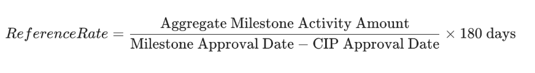

<pre>
CIP: 0113
Title: Add Further Asset Management as a Super Validator (Weight 8.0)
Author: Yiannis Varelas
Status: Proposed
Type: Governance
Created: 2025-11-26
Updated: 2026-03-03
License: CC0-1.0
</pre>

## Abstract

This proposal seeks to add Further Asset Management (“Further”) as a Super Validator (SV) on the Canton Network with a maximum reward weight of 8.0, earned through milestone-based delivery and perpetual economic sustainment. Further will act as a regional aggregation layer for the GCC, onboarding sovereign-aligned capital and regulated settlement workflows via its portfolio companies (BridgePort, Pave Bank, Kaio, and Fuze).

## About Further Asset Management
Further is an investment and infrastructure platform operating across the UAE and broader GCC region. As an SV, Further’s role is to coordinate and deliver institutional-grade applications that generate sustained, customer-driven Canton Network activity.

## Deliverables for SV Reward (Weight 8.0)

| Deliverable | Acceptance Criteria | Deadline | Weight Earned |
|-------------|---------------------|----------|---------------|
| **Atomic Off-Exchange Settlement (BridgePort)** | Margin financing app go-live; activity reflects real customer trading. | 6 months | +0.5 (Infra)  +0.5 per **$2M equivalent of Canton Coin burned**, up to **+1.5 max** |
| **Regulated Settlement & Fiat On-Ramp (Pave Bank)** | Successful CIP-0056 asset mint/redeem; live fiat connectivity. | 12 months | +0.5 (Infra)  +0.5 per **$200M of CIP-0056 assets transferred by independent customers**, up to **+1.5 max** |
| **Sovereign Asset Origination & ADX Integration (Kaio)** | Zodia integration; $100M+ customer TVL; ADX POC/Issuance. | 12 months | +0.5 (Infra)  +0.5 per **$250M TVL**, up to **+1.5 max** |
| **Cross-Border Institutional Payments (Fuze)** | Live payments app; regulated UAE fiat on/off-ramp. | 12 months | +0.5 (Infra)  +0.5 per **$2M in Canton Coin fees burned**, up to **+1.5 max** |
| **Total Maximum Earnable Weight: 8.0** |  |  |  |

## Eligible Activity & Sustainment Criteria

**1. Eligible Activity & Pro-Rata Attribution**

To ensure accountability and prevent double-counting across the ecosystem:

- **Owned Address Registry:** Further must provide a registry of owned/controlled addresses for its portfolio entities to the Accountability Committee.

- **Pro-Rata Attribution:** For activity involving third-party participants or other SVs, attribution will be applied pro-rata — except where Further owns and operates the application generating the activity. For Further’s owned applications (BridgePort and Fuze), Further may count 100% of eligible burn activity generated through those applications toward its milestone thresholds, regardless of whether a third-party transaction participant also claims the same activity under a separate CIP.

- **Economic Causality:** Metrics must be a necessary consequence of application usage, not discretionary or artificially induced.

**2. Perpetual Sustainment Requirement (High Water Mark)**

Weight earned via activity-based milestones (+6.0 max) is subject to a perpetual sustainment requirement to align with the ongoing nature of SV rewards.

- **Reference Rate Calculation:** For each tranche, the "Reference Rate" is the per-2-quarter rate of activity required for approval:

  

- **Drop in Activity Definition:** A >50% decline in the rolling 2-quarter average eligible activity (Burn, Volume, or TVL) relative to the Reference Rate.

- **Weight Re-Earn:** Following a weight reduction under the Remediation provision, Further may re-earn the reduced weight by restoring eligible activity above the applicable Reference Rate. The re-earn window for each tranche equals the original milestone deadline for that tranche (e.g., 12 months for a 12-month milestone). The 6-month cure/remediation period during which the drop in activity is assessed counts as part of this re-earn window — leaving the remainder of the original milestone period (e.g., 6 months) as the active re-earn period following any weight reduction. Re-earn is assessed on a per-tranche basis. Infrastructure-based weight (+2.0 total) remains excluded from this provision.

- **Remediation:** If the decline persists for 2 consecutive quarters, the Accountability Committee reserves the right to apply a proportional weight reduction.

- **Exclusions:** Infrastructure-based weight (+2.0 total) is not subject to clawback.

## Anti-Gaming & Double-Counting Protections
- Self-cycling, wash activity, or circular transactions are explicitly excluded.

- The Tokenomics Working Group retains discretion to exclude activity deemed non-economic.

## Measurement & Reporting
Further must submit a quarterly Regional Activity Report detailing:

- Transaction hashes and asset proofs across all portfolio entities.

- Attribution breakdown (Owned vs. Pro-rata 3rd Party).

- Current 2-quarter averages vs. established Reference Rates.

## SV Reward Mechanics

- An extraBeneficiary PartyID will be configured in escrow with the full 8.0 weight.

- Upon milestone completion, Further presents proof to the Tokenomics Working Group.

- If approved, the GSF updates the extraBeneficiary to Further’s PartyID for the earned portion.

Failure to maintain Reference Rates allows the Accountability Committee to recommend weight removal.

## Motivation

Further’s role as a regional aggregator delivers a unique multiplier effect to the Canton Network. By implementing perpetual sustainment and pro-rata attribution, this CIP ensures that Further’s weight remains a transparent, accurate, and long-term reflection of the actual institutional flow they maintain within the GCC region.

## Copyright
This CIP is licensed under CC0-1.0.

## Changelog
- **Updated:** 2026-03-03
- **Created:** 2025-11-26
